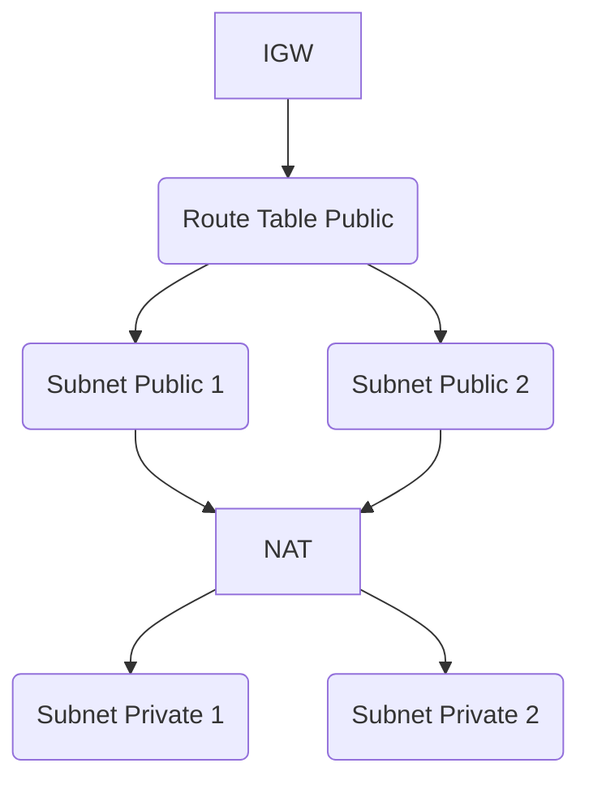

```mermaid
flowchart TD
    IGW --> B(Route Table Public)
    B --> C(Subnet Public 1)
    B --> D(Subnet Public 2)
    C --> NAT
    D --> NAT
    NAT --> E(Subnet Private 1)
    NAT --> F(Subnet Private 2)
```